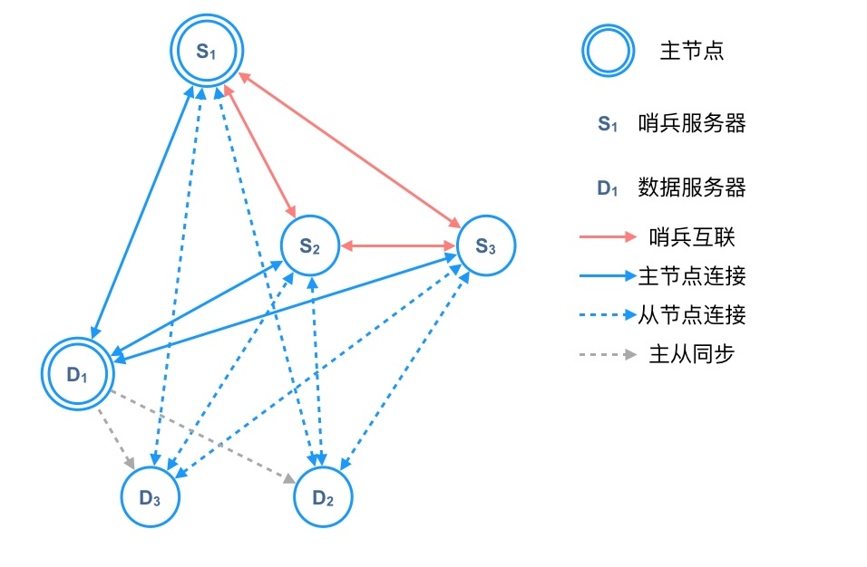

* content
{:toc}

# 第十五章 复制
介绍了redis在2.8版本之前，以及在2.8版本之后的主从复制策略与实现。提一句，最新版本（2020年5月份）是5.0，看来本书已经足够旧了。

## 2.8版本之前
主从复制策略有两种，一种叫同步`sync`，一种叫命令传播`command propagate`。
+ **同步** 命令由从节点发起，主节点在接收到该命令之后，会生成一份RDB文件，并将RDB文件同步给从节点，然后将生成RDB文件过程中的写命令缓冲区同步给从节点。从节点先通过RDB命令来载入数据，载入完成后，再将写命令缓冲区载入数据库。
+ **命令传播** 主节点在执行写入命令时，将该写入命令同步给从节点，从节点也执行写入命令来达到一致。

对于同步策略而言，启动时同步没有什么问题，对于从节点断线重连的场景，会有大量的资源浪费：从节点需要主节点重新生成一份RDB文件。因此在redis的2.8版本之后，支持了新的同步策略来解决断线重连的问题

## 2.8版本之后
针对从节点断线重连的场景，redis提出了部分重同步的策略来改进全量不同的弊端。部分重同步的核心思路就是记录每个从节点当前的复制偏移量，在从节点断线重连后，只同步该偏移量之后的所有数据。具体实现上有以下几点
+ 所有节点生成节点id，节点id在集群内唯一。
+ 从节点保存当前同步主节点的节点id。在断线重连后，如果该节点id与重连主节点id一致，则进行增量同步；如果不一致，则进行全量同步。
+ 主节点的所有写入命令保存在同步缓冲区中，缓冲区大小可配置，默认状态为1M。缓冲区满后，将采用FIFO策略替换数据。增量同步仅能同步缓冲区中的数据。

## 心跳检测
在集群启动之后，从节点将定时向主节点发送心跳检测数据包，数据包中含有从节点的复制偏移量，用于检测节点链接情况以及数据同步偏移量是否一致。额外的，主节点也会根据从节点的心跳数据包判断当前集群状态是否健康，在不健康（指超过一定数量的从节点无法连接 或 延迟高于一定值）的状态下，将拒绝数据写入，直到集群恢复正常。

# 第十六章 Sentinel（哨兵）
本章介绍了redis集群中哨兵的作用以及运行机制，还介绍了哨兵的部分数据结构。哨兵本身也是一个redis服务器，区别在于启动时需要指定哨兵模式启动，并且需要替换部分源文件为哨兵服务器专属文件。

## 连接关系

redis中的哨兵节点与数据节点的连接关系如图所示。各连接的具体作用如下：
+ **哨兵节点之间的连接** 用于哨兵集群之间的选主
+ **哨兵节点与数据节点的连接** 用于哨兵节点之间的通信以及数据节点状态的监控
+ **数据节点之间的连接** 用于数据节点之间的数据同步

# 第十七章 集群

# 总结